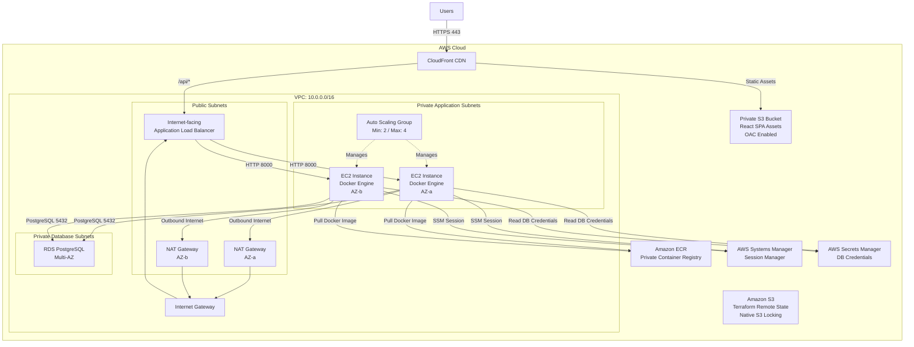

# 🍽️ AWS 3-Tier Web Application Infrastructure

A simple, production-ready, and maintainable AWS 3-tier infrastructure deployment for an outsource client using Terraform.

This repository provisions an edge-cached **CloudFront CDN + S3** static frontend, an internet-facing **Application Load Balancer (ALB)**, an **EC2 Auto Scaling Group (ASG)** running containerized backend services pulled from a private **Amazon ECR** repository across private subnets, and an isolated **Multi-AZ RDS PostgreSQL** database tier.

Terraform remote state is stored in **Amazon S3** with **native S3 state locking** using `use_lockfile = true`, eliminating the need for a DynamoDB lock table.

---

## 🏗️ 1. Architecture Overview



### Architecture Flow

The application traffic follows this flow:

```text
                         ┌──────────────┐
                         │    Users     │
                         └──────┬───────┘
                                │ HTTPS
                                ▼
                       ┌─────────────────┐
                       │   CloudFront    │
                       │      CDN        │
                       └───────┬─────────┘
                               │
                    ┌──────────┴──────────┐
                    │                     │
              Static Assets            /api/*
                    │                     │
                    ▼                     ▼
             ┌───────────┐          ┌───────────┐
             │ S3 Bucket │          │    ALB    │
             │   React   │          └─────┬─────┘
             └───────────┘                │
                                          │ :8000
                                   ┌──────┴──────┐
                                   │     ASG     │
                                   └──────┬──────┘
                                          │
                              ┌───────────┴───────────┐
                              │                       │
                              ▼                       ▼
                         ┌─────────┐             ┌─────────┐
                         │   EC2   │             │   EC2   │
                         │ Docker  │             │ Docker  │
                         └────┬────┘             └────┬────┘
                              │                       │
                              └──────────┬────────────┘
                                         │
                                         │ :5432
                                         ▼
                                  ┌──────────────┐
                                  │ RDS PostgreSQL│
                                  │   Multi-AZ    │
                                  └──────────────┘
```

### Supporting Services

```text
EC2
 ├── Pulls backend images from Amazon ECR
 ├── Uses AWS Systems Manager Session Manager
 └── Reads database credentials from AWS Secrets Manager

Terraform
 └── Stores remote state in Amazon S3
      └── Uses native S3 state locking (.tflock)
```

---

## 🌐 Network Topology & Traffic Routing

| Subnet Tier             | CIDR Blocks                    | Route Target     | Components             | Public Access            |
| ----------------------- | ------------------------------ | ---------------- | ---------------------- | ------------------------ |
| **Public Subnets**      | `10.0.1.0/24`, `10.0.2.0/24`   | Internet Gateway | ALB, NAT Gateways      | Internet-facing          |
| **Private App Subnets** | `10.0.11.0/24`, `10.0.12.0/24` | NAT Gateway      | EC2 Auto Scaling Group | No inbound public access |
| **Private DB Subnets**  | `10.0.21.0/24`, `10.0.22.0/24` | Local VPC only   | RDS PostgreSQL         | No internet access       |

### Traffic Rules

| Source     | Destination      |       Port | Purpose                                |
| ---------- | ---------------- | ---------: | -------------------------------------- |
| Internet   | CloudFront       |      `443` | HTTPS frontend access                  |
| CloudFront | S3               |      HTTPS | React static assets via OAC            |
| CloudFront | ALB              | HTTP/HTTPS | `/api/*` API traffic                   |
| ALB        | EC2              |     `8000` | Backend API                            |
| EC2        | RDS              |     `5432` | PostgreSQL                             |
| EC2        | ECR              |      `443` | Pull Docker images                     |
| EC2        | AWS SSM          |      `443` | Session Manager                        |
| EC2        | Internet via NAT |      `443` | Package updates and AWS service access |

---

## 🔐 Security Group Flow

The infrastructure uses security-group chaining between application tiers:

```text
Internet
   │
   │ HTTPS
   ▼
┌────────────────────┐
│    ALB Security    │
│       Group        │
└─────────┬──────────┘
          │
          │ TCP 8000
          ▼
┌────────────────────┐
│    App EC2         │
│    Security Group  │
└─────────┬──────────┘
          │
          │ TCP 5432
          ▼
┌────────────────────┐
│    RDS Security    │
│       Group        │
└────────────────────┘
```

The rules are:

* ALB accepts public web traffic.
* EC2 accepts port `8000` **only from the ALB security group**.
* RDS accepts port `5432` **only from the EC2 application security group**.
* RDS has no public access.
* SSH port `22` is not exposed.
* EC2 management is performed through AWS Systems Manager Session Manager.

---

## 📂 2. Project Directory Structure

Terraform is maintained in a **separate infrastructure repository** from the application source code.

### Application Repository

```text
food-order-3tier-aws/
├── backend/                    # FastAPI backend application
├── frontend/                   # React + Vite frontend SPA
├── scripts/                    # Deployment and helper scripts
├── docker-compose.yml
├── docker-compose.override.yml
├── Makefile
└── README.md
```

### Infrastructure Repository

```text
food-order-3tier-infra/
├── main.tf                     # Provider, backend, default tags
├── variables.tf                # Input variables and validation
├── outputs.tf                  # Infrastructure outputs
├── terraform.tfvars.example    # Example configuration
├── vpc.tf                      # VPC, subnets, routes, IGW, NAT
├── security_groups.tf          # ALB, App and RDS security groups
├── alb.tf                      # Application Load Balancer
├── asg.tf                      # Launch Template and Auto Scaling Group
├── ecr.tf                      # Amazon ECR repository
├── rds.tf                      # RDS PostgreSQL and Secrets Manager
├── frontend.tf                 # S3 frontend bucket and CloudFront
├── ssm.tf                      # Systems Manager configuration
├── .terraform.lock.hcl         # Terraform provider lock file
├── .gitignore
└── README.md
```

---

## 🔄 Repository Separation

The application and infrastructure are intentionally separated:

```text
GitHub
│
├── food-order-3tier-aws
│   │
│   ├── Backend
│   ├── Frontend
│   ├── Docker
│   └── Application CI/CD
│
└── food-order-3tier-infra
    │
    ├── Terraform
    ├── AWS Infrastructure
    └── Infrastructure CI/CD
```

This separation means:

* Application changes do not require Terraform changes.
* Infrastructure changes do not require rebuilding the application.
* Application CI/CD handles Docker/ECR/ASG deployment.
* Infrastructure CI/CD handles Terraform.
* Terraform state remains in the S3 backend.
* Infrastructure source code is version-controlled independently.

---

## 🚀 3. Infrastructure Deployment Flow

```text
Developer
    │
    ▼
food-order-3tier-infra
    │
    ▼
Terraform
    │
    ├── terraform fmt
    ├── terraform validate
    ├── terraform plan
    └── terraform apply
            │
            ▼
       AWS Infrastructure
```

Application deployment is handled separately:

```text
Developer
    │
    ▼
food-order-3tier-aws
    │
    ├───────────────┐
    │               │
    ▼               ▼
Backend           Frontend
    │               │
    ▼               ▼
Docker/ECR       Vite Build
    │               │
    ▼               ▼
ASG Refresh      S3 Upload
                    │
                    ▼
               CloudFront
```

## 🤖 4. GitHub Actions ဖြင့် Terraform CI/CD

ဒီ repository မှာ PR ဖွင့်တဲ့အခါ Plan စစ်ဆေးပြီး၊ `main` ထဲ merge ဖြစ်တဲ့အခါ Apply လုပ်တဲ့ workflow နှစ်ခု ပါဝင်ပါတယ်။

```text
Feature branch push
        │
        ▼
Pull Request ဖွင့်
        │
        ├── terraform fmt / init / validate / plan
        └── Plan ရလဒ်ကို PR comment နှင့် Actions Summary တွင်ပြ
                    │
                    ▼
             လူက Plan နှင့် Code ကို review
                    │
                    ▼
               main သို့ merge
                    │
                    ▼
      production Environment approval (သတ်မှတ်ထားလျှင်)
                    │
                    ▼
       အသစ်ပြန် plan လုပ်ပြီး terraform apply
```

### Workflow ဖိုင်များ

* `.github/workflows/terraform-plan.yml` — `main` ကို target လုပ်သော PR တွင် Terraform format, initialize, validate, plan ကို run လုပ်ပြီး ရလဒ်ကို PR comment ရေးပေးသည်။ Same-repository PR များသာ AWS OIDC credentials ရယူနိုင်သည်။
* `.github/workflows/terraform-apply.yml` — Terraform ဖိုင်များပြောင်းလဲပြီး `main` သို့ push/merge ဖြစ်သောအခါ `production` Environment အောက်တွင် plan အသစ်ပြန်လုပ်ပြီး `terraform apply -auto-approve` ကို run လုပ်သည်။ Merge လုပ်ချိန်က PR plan ကို တိုက်ရိုက်အသုံးမပြုဘဲ လက်ရှိ state နှင့် code အပေါ် plan အသစ်ထုတ်သည်။

Workflow နှစ်ခုစလုံးမှာ Terraform input အဖြစ် `terraform.tfvars.example` ကိုသုံးသည်။ အဲဒီဖိုင်ထဲက တန်ဖိုးများကို အမှန်တကယ် deployment အတွက် ပြင်ဆင်ပြီး commit လုပ်ပါ။ Local `terraform.tfvars` သည် `.gitignore` ထဲတွင်ရှိသောကြောင့် GitHub Runner သို့ မတက်ပါ။ Secret တန်ဖိုးများကို tfvars ထဲ မထည့်ပါနှင့်။

### GitHub နှင့် AWS တစ်ကြိမ်တည်း ပြင်ဆင်ရန်

1. AWS IAM မှာ GitHub Actions အတွက် **OIDC Identity Provider** (`token.actions.githubusercontent.com`) နှင့် IAM Role တစ်ခု ဖန်တီးပါ။ Role trust policy ရဲ့ audience ကို `sts.amazonaws.com` သတ်မှတ်ပြီး subject ကို သင့် repo အတွက် ကန့်သတ်ပါ။ ဤ workflow များအတွက် subject များမှာ `repo:OWNER/REPO:pull_request` နှင့် `repo:OWNER/REPO:ref:refs/heads/main` ဖြစ်သည်။ `OWNER/REPO` ကို သင့် GitHub လိပ်စာနှင့် အစားထိုးပါ။
2. ထို IAM Role ကို Terraform plan အတွက် AWS resources ကို ဖတ်ရှုနိုင်ရန်၊ S3 backend state နှင့် `.tflock` ကို အသုံးပြုနိုင်ရန် လိုအပ်သည့်အခွင့်အရေးများ ပေးပါ။ Apply အတွက် သတ်မှတ်ထားသော infrastructure ကို ပြောင်းလဲရန် လိုအပ်သည့်အခွင့်အရေးများ ထပ်ပေးပါ။ Backend S3 bucket ကို workflow မစမီ ရှိပြီးသားဖြစ်ရမည်။
3. GitHub repository ၏ **Settings → Secrets and variables → Actions → Variables** တွင် အောက်ပါတို့ သတ်မှတ်ပါ။

   * `AWS_TERRAFORM_ROLE_ARN` — အဆင့် ၁ မှ IAM Role ARN
   * `AWS_REGION` — `ap-southeast-1` (မသတ်မှတ်လျှင် workflow က ဒီတန်ဖိုးကို default သုံးသည်)

4. **Settings → Environments** တွင် `production` Environment ဖန်တီးပြီး လိုအပ်ပါက **Required reviewers** ထည့်ပါ။ Reviewer approval လိုအပ်လျှင် merge ပြီးနောက် apply job သည် approval ရသည်အထိ စောင့်မည်။
5. **Settings → Branches** တွင် `main` အတွက် branch protection သတ်မှတ်ပြီး PR review နှင့် `plan` check အောင်မြင်မှုကို merge လုပ်ရန် မဖြစ်မနေလိုအပ်အောင် ပြင်ဆင်ပါ။

### လက်တွေ့အသုံးပြုပုံ

1. `feature/...` branch အသစ်ဖန်တီးပြီး `.tf` ဖိုင်များ သို့မဟုတ် `terraform.tfvars.example` ကို ပြင်ပါ။
2. Push လုပ်ပြီး `main` သို့ PR ဖွင့်ပါ။ `Terraform Plan` workflow အောင်မြင်ပြီးနောက် PR comment ထဲက add/change/destroy အရေအတွက်နှင့် resource အသေးစိတ်ကို စစ်ပါ။
3. Reviewer က Terraform code နှင့် AWS ပြောင်းလဲမည့်အရာများကို စစ်ဆေးပြီး approve လုပ်ကာ PR ကို merge လုပ်ပါ။
4. Merge-ийн дараа `Terraform Apply` workflow ажилပြီး `production` approval လိုအပ်ပါက approver က အရင်အတည်ပြုရပါမည်။ အောင်မြင်လျှင် AWS infrastructure ပြောင်းလဲသွားပါမည်။

> `-auto-approve` သည် လူကို `yes` ဟု ရိုက်ခိုင်းမှုကိုသာ ဖယ်ရှားခြင်းဖြစ်သည်။ Review နှင့် Environment approval တို့ကို အစားမထိုးပါ။ AWS IAM permissions နှင့် GitHub OIDC trust ကို သင့် repository နှင့် လိုအပ်သည့် resources များအတွက်သာ ကန့်သတ်ပါ။

---

## 🗄️ Terraform Remote State

Terraform state is stored remotely in Amazon S3:

```text
S3 Bucket:
food-order-tfstate-<ACCOUNT_ID>-ap-southeast-1

State Key:
networking/terraform.tfstate

Lock:
networking/terraform.tfstate.tflock
```

The backend uses native S3 state locking:

```hcl
terraform {
  required_version = ">= 1.10.0"

  backend "s3" {
    bucket       = "food-order-tfstate-<ACCOUNT_ID>-ap-southeast-1"
    key          = "networking/terraform.tfstate"
    region       = "ap-southeast-1"
    encrypt      = true
    use_lockfile = true
  }
}
```

No DynamoDB table is required for state locking.

---

## ⚠️ Important

The Terraform state **must not** be committed to Git.

The following files/directories should remain ignored:

```text
.terraform/
*.tfstate
*.tfstate.*
*.tfplan
terraform.tfvars
*.auto.tfvars
```

The following files **should be committed**:

```text
*.tf
terraform.tfvars.example
.terraform.lock.hcl
.gitignore
README.md
```
